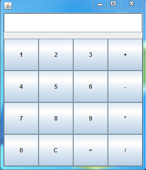
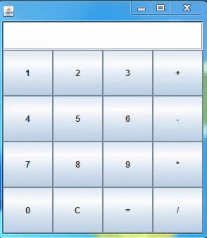

# Simple-calculator
<html>
<body>

This Calculator first converts the user given input into postfix expression i.e, from <strong>infix<strong> to <strong>postfix<strong>expression

The data structure used is stack which converts infix expression to postfix expression

The postfix expression is evaluated and result is displayed to the user

Each number in input can be of multiple digits

</body>
</html>

